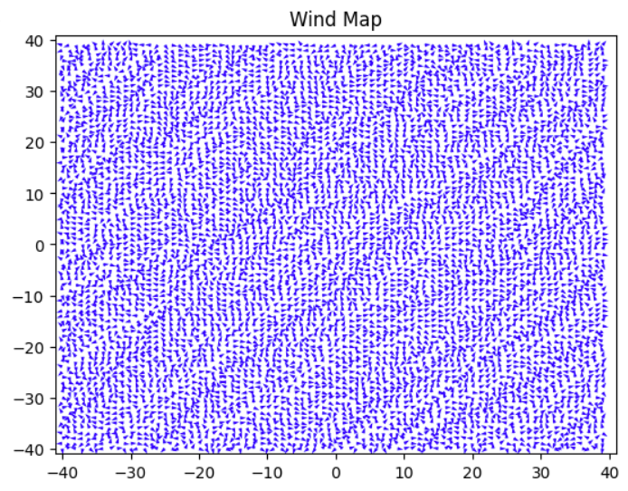

# `WindMap` Class



This class initializes an instance of a wind map. A wind map is defined as a plane of vectors, where each vector determines the strength of wind at a certain "step" along the map, and the direction. 

The wind map is generated not as a matrix of vectors, but rather two separate matrices: the "compass" and "scalar" matrices. The `compass` matrix holds all of the directions of the vectors (0-359deg), and the `scalar` matrix holds all of the magnitudes of them.

Each matrix is generated in the same manner:

1. The top left corner of the matrix is initialized with a random value in the appropriate range (`compass`: 0-359, `scalar`: you decide)
2. The matrix is ran through row-by-row, left to right, using the *immediate surrounding* 8 vectors (or any subset that are generated) to calculate an average for the new vector. A tunable noise for the compass vector is provided in [defaults.py](../components/defaults.py).

> TODO: Random wind patterns (i.e., no wind, swirls) are not considered in the generation of a wind map

Wind maps are **centered** at (0,0), which means `matrix[0,0]` is not the same as `coord(0,0)`. See [defaults](./Defaults.md) for a function that converts from (0,0) to [0,0].

## Initialization

```py
MyWindMap = WindMap(x = 100 # -50 - 50 in x-dir
                    y = 100 # -50 - 50 in y-dir
                    step = 1) # step for map
```

## Methods

### WindMap.create_windmap()

Creates the scalar and compass matrices for the wind map with initialized x,y and step size.

### WindMap.compass() and .scalar()

Return the compass and scalar matrices.

### WindMap.bound(border)

Creates a border around the map using vectors that point inward, so that if the balloon gets to the edge of the map, it is propelled inward.

> TODO: A large enough map (500x500) should alleviate this problem.

## WindMap Data

- `_dimmensions`: 1x2 list where idx 0 is `x` and idx 1 is `y`.
- `step`: Step size of the wind map.
- `_compass_matrix`: Compass matrix of the wind map.
- `_scalar_matrix`: Scalar matrix of the wind map.